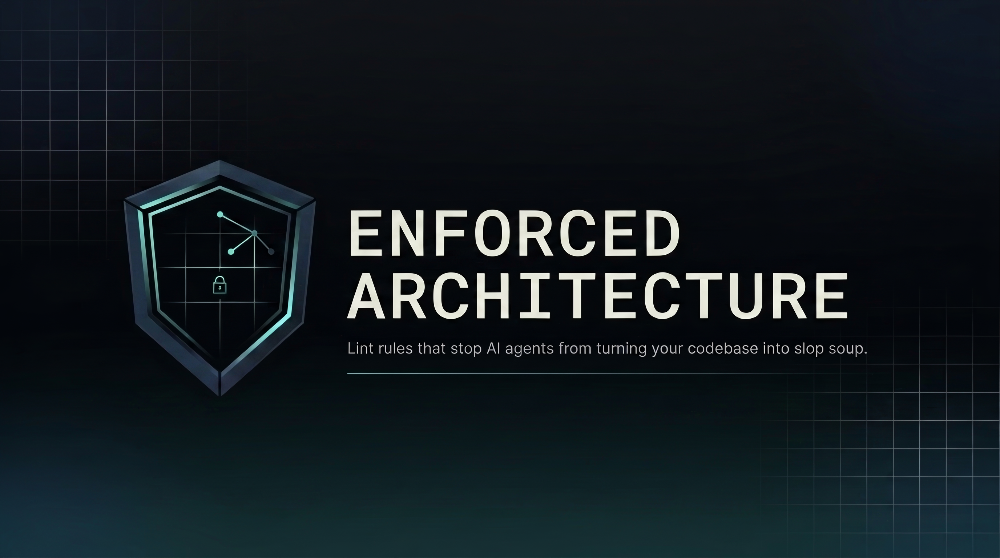

# Encode your architecture as lint rules your agents can't ignore

A catalog of 70 ready-to-steal enforcement rules for TypeScript codebases. Steal them, or point your coding agent here and have it design the equivalent for your stack.

**The problem:** agents write a lot of code, fast, like an army of interns. Documentation doesn't hold them to your conventions—they don't read it, or they read it and forget by the next file. Your architecture decays one plausible-looking PR at a time.

**The fix:** make the constraint blocking. An agent writes something wrong, gets an error that tells it exactly what to do instead, and corrects itself. No human in the loop.

## What you get

- **Rules that explain their own fix.** The error message *is* the instruction, so an agent resolves a violation without reading another file or asking you.
- **Boundaries that hold.** Not a convention people remember—an import that can't exist.
- **70 rules across 11 categories**, each with a header stating what it prevents and an **Adapt** section for repointing it at your directory layout.

## Quick start

**Option 1—point your agent at this repo.** This is what most people should do:

> Read https://github.com/GLips/enforced-architecture. Figure out which boundaries matter for this codebase, then write the enforcement rules in whatever our project uses.

The rules target a specific stack; the reasoning behind them doesn't. The catalog works as a menu of ideas as much as a set of files.

**Option 2—install the skill and steal the rules.** Best fit if you're on Bun + TanStack Start + Drizzle + oxlint:

```bash
npx skills add GLips/enforced-architecture
```

The catalog is split by **tier** first, tag second, and your project gets the same tree:

```
lint/
  policy/       tables both tiers read
  oxlint/       per-file rules — plugin.ts, lib/, and a folder per tag
  structural/   whole-tree checks — the substrate, your arch.config.ts, and a folder per tag
```

So adopting a rule is copying a path, and the path says which tier you're in.

Start with [`lint/overview.md`](skills/enforced-architecture/references/lint/overview.md)—it maps the eleven tags, says which tier each one lands in, and has a *Selecting rules* table for "if your project has X, take these." Each tag folder has its own `overview.md` listing that tier's half of the tag.

## What happens when an agent breaks a rule

Your agent is building an invoice list and reaches straight for the database from a UI component:

```ts
// src/features/billing/ui/invoice-list.tsx
import { db } from "@/infrastructure/db";
```

It never reaches you. The lint blocks it, and the message is the fix instruction:

```
error  arch(db-isolation)  DB client/schema imports are restricted to
infrastructure/*, features/*/repo/*, and features/*/controllers/*.
Move this DB access to a repo or controller module.
```

The agent moves the query into `features/billing/repo/`, re-runs, and carries on—no review comment from you, no convention to re-explain next week. It's why the error text gets as much care as the matching logic.

One boundary like that kills an entire class of bugs, because the import can't exist outside the layer that's allowed to have it.

## What's in the catalog

| Category | Rules | Protects |
|---|---|---|
| **boundary** | 12 | Layer direction and import restrictions—DB isolation, SDK containment, client/server splits, thin routes |
| **types** | 12 | Type evidence—untyped `Record` bags, `unknown` in contracts, unjustified `as`, type arguments doing an assertion's job |
| **placement** | 9 | Where code may live—where server functions live, where schemas live, validation that can't be skipped |
| **style** | 9 | Design-system adherence—no raw hex, no arbitrary class values, no inline styles outside the primitives layer |
| **api** | 6 | Public API surface—barrel conventions, no deep imports past a barrel, no server-only code leaking client-side |
| **react** | 6 | Code smells—derived state, direct `fetch` in components, async effects without cleanup, oversized components |
| **effect** | 6 | Effect-TS policy—no silent error swallowing, no unvalidated Schema opt-outs, no `sql<Row>` claims without a decoder |
| **health** | 4 | Quality metrics—file size, doc word ceilings, nested ternaries, pass-through wrappers |
| **naming** | 3 | Searchability—no `export *`, no renamed re-exports, no names like `UserShape` that describe a category instead of a role |
| **graph** | 3 | Cross-file dependency analysis—dependency cycles, feature coupling thresholds |
| **testing** | 1 | Test design—no module mocking, so tests couple to behaviour rather than to import paths |

The split is the top level of the tree. 54 rules live in `lint/oxlint/` and run as [oxlint](https://oxc.rs/docs/guide/usage/linter) plugin rules, per-file and in real time. The other 16 live in `lint/structural/` and run pre-commit against the whole tree, because questions like "does this import cross a feature boundary?" can't be answered from one file. They share one resolved import graph and one config object, so adopting one means setting a few values rather than reimplementing an algorithm. (One `graph` entry is that shared import graph, not a rule itself.)

Almost every rule **blocks** rather than warns. Agents treat warnings as "it's fine."

## Principles

- **If a constraint isn't enforced by tooling, it doesn't exist.** The rules teach amnesiac agents by blocking them from doing wrong things.
- **Predictable structure enables autonomous navigation.** An agent should answer "where does this code live?" from the directory layout alone.
- **Anti-ceremony.** The goal is the *minimum* structure that protects your dependency invariants. Layers are optional—but if a layer exists, you can't bypass it. No empty directories, no boilerplate for hypothetical needs.
- **Blocking from day one.** Every rule either blocks or isn't a rule yet.

The full reasoning lives in [`architecture-principles.md`](skills/enforced-architecture/references/architecture-principles.md).

This is heavily inspired by OpenAI's [harness engineering](https://openai.com/index/harness-engineering/) writeup, where their team shipped a 1M-line codebase with essentially zero hand-written code by leaning on layered domains, fixed dependency direction, and custom linters with agent-targeted error messages. As they put it:

> "This is the kind of architecture you usually postpone until you have hundreds of engineers. With coding agents, it's an early prerequisite—the constraints are what allow speed without decay or architectural drift."

## Will this fit my stack?

The templates target Bun, TanStack Start, oxlint, Drizzle, Postgres, React, Zod, and lefthook, written against one standard layout (`src/features/<name>/{controllers,repo,service,ui}`, `src/domains`, `src/infrastructure`, `src/shared/ui`, and the `@/` alias).

**On that stack?** Most rules are close to drop-in. Each one's **Adapt** section names the seams—the path patterns, package lists, and exempt directories you're most likely to repoint.

**On something else?** The rules won't paste in, but the boundaries they encode don't depend on your framework, and every rule spells out its own reasoning. Point your agent at the repo and let it translate them to ESLint, ArchUnit-style fitness functions, or plain scripts. That's the intended use for most readers.

Either way, confirm your adapted rule still fires before you trust it. A lint rule that stops matching doesn't error—it goes green, and a passing check looks exactly like a working one. Every rule here is proved against three kinds of case in CI before it reaches you: the obvious violation, the adversarial spelling that beats a naive implementation, and the legal neighbour that must stay silent. oxlint rules carry their spec in the file beside them, so copy it along with the rule and repoint it at your paths; the cross-file checks are proved against a shared fixture tree that stays in this repo, so their equivalent is fixtures you write once against your own code. ([How that's set up.](harness/README.md))

## License

MIT
